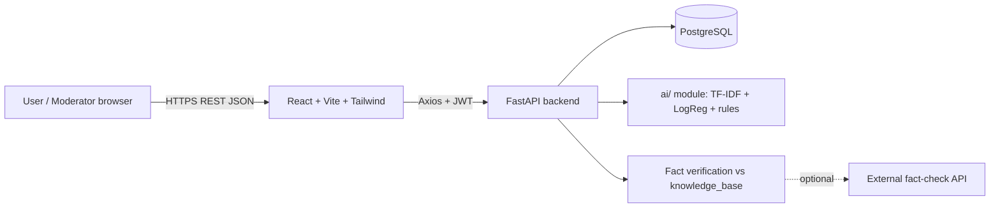
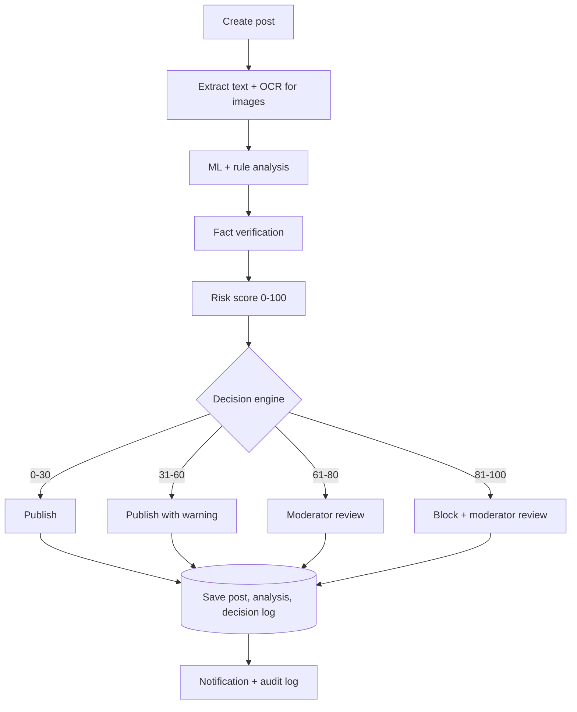
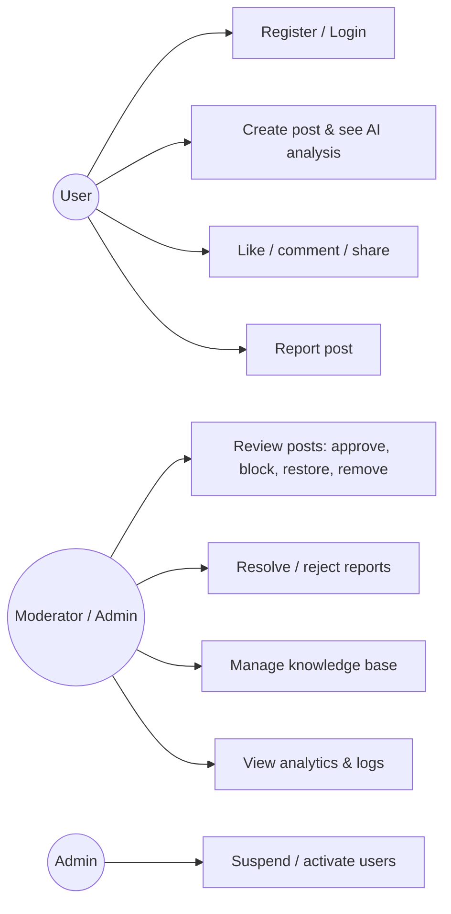
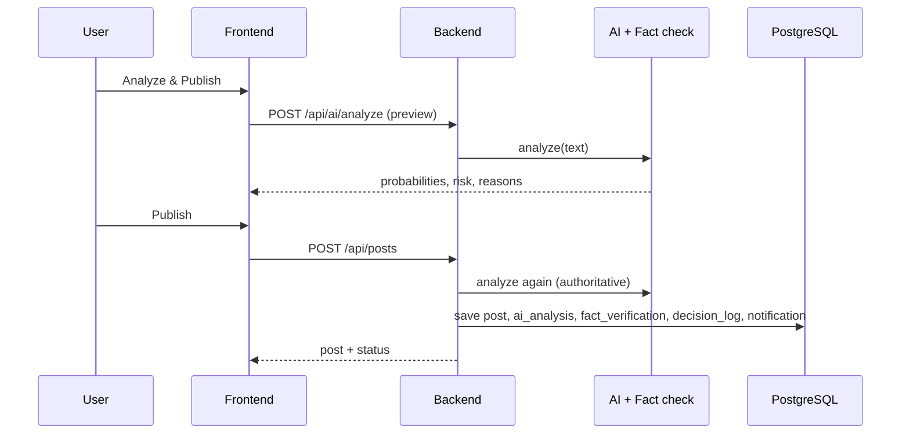
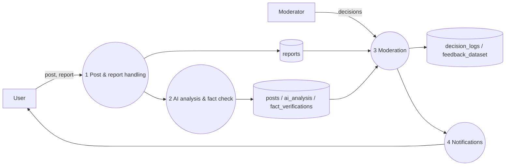

# 02 - System architecture

```mermaid
flowchart LR
  U[User / Moderator browser] -->|HTTPS REST JSON| FE[React + Vite + Tailwind]
  FE -->|Axios + JWT| API[FastAPI backend]
  API --> DB[(PostgreSQL)]
  API --> AI[ai/ module: TF-IDF + LogReg + rules]
  API --> FV[Fact verification vs knowledge_base]
  FV -.optional.-> EXT[External fact-check API]
```

## Post pipeline (activity diagram)

```mermaid
flowchart TD
  A[Create post] --> B[Extract text + OCR for images]
  B --> C[ML + rule analysis]
  C --> D[Fact verification]
  D --> E[Risk score 0-100]
  E --> F{Decision engine}
  F -->|0-30| G[Publish]
  F -->|31-60| H[Publish with warning]
  F -->|61-80| I[Moderator review]
  F -->|81-100| J[Block + moderator review]
  G & H & I & J --> K[(Save post, analysis, decision log)]
  K --> L[Notification + audit log]
```

## Use cases

```mermaid
flowchart LR
  User((User)) --> UC1[Register / Login]
  User --> UC2[Create post & see AI analysis]
  User --> UC3[Like / comment / share]
  User --> UC4[Report post]
  Mod((Moderator / Admin)) --> UC5[Review posts: approve, block, restore, remove]
  Mod --> UC6[Resolve / reject reports]
  Mod --> UC7[Manage knowledge base]
  Mod --> UC8[View analytics & logs]
  Admin((Admin)) --> UC9[Suspend / activate users]
```

## Sequence: create post

```mermaid
sequenceDiagram
  participant U as User
  participant F as Frontend
  participant B as Backend
  participant A as AI + Fact check
  participant D as PostgreSQL
  U->>F: Analyze & Publish
  F->>B: POST /api/ai/analyze (preview)
  B->>A: analyze(text)
  A-->>F: probabilities, risk, reasons
  U->>F: Publish
  F->>B: POST /api/posts
  B->>A: analyze again (authoritative)
  B->>D: save post, ai_analysis, fact_verification, decision_log, notification
  B-->>F: post + status
```

## Data-flow (level 1)

```mermaid
flowchart LR
  U[User] -->|post, report| P1((1 Post & report handling))
  P1 --> P2((2 AI analysis & fact check))
  P2 --> D1[(posts / ai_analysis / fact_verifications)]
  P1 --> D2[(reports)]
  M[Moderator] -->|decisions| P3((3 Moderation))
  D2 --> P3
  D1 --> P3
  P3 --> D3[(decision_logs / feedback_dataset)]
  P3 --> N((4 Notifications)) --> U
```
